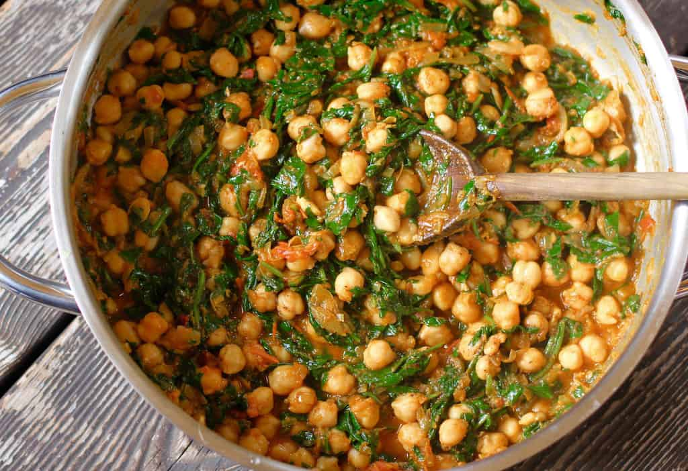

# Chana Saag (Spinach-Chickpea curry)

### INGREDIENTS
* 500g chickpeas (cooked)
* spinach
* 1 tomato
* 1 onion
* 1 tsp chilli
* 1/2 tsp garam masala
* 3 cloves garlic
* 2-cm knob ginger
* coriander seeds
* cumin
* cardamom

### INSTRUCTIONS
1. Roast the coriander, cumin and cardamom in a pan with oil. When they start sizzling add the finely chopped onion and sauté
2. Puree the ginger and garlic to a paste and add it to the pan.
3. Next, chop the tomato roughly and add it together with the spinach and masala to the pan, stirring for a couple of minutes until it disintegrates. When it does, add half a cup of warm water. lower the heat to medium and let the spices infuse the tomato for about 30min.
4. Now, rinse and drain the chickpeas and mix them in. Let the chickpeas cook with the spices for another five minutes.
