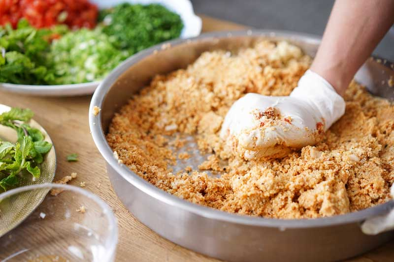

# Cig Köfte

### INGREDIENTS
* 500g bulgur (Köftelik)
* 5 tomatoes
* 2 Onions
* 3 garlic cloves
* 1 tsp salt
* 1 tsp pepper
* 1 tbsp cumin
* 3 tbsp chili
* 3 tbsp isot
* 40g tomato paste
* 40g paprika paste
* 5 spring onions
* 1 cup parsley
* 1 cup mint
#### FOR DÜRÜM
* dürüm
* mint
* tomato
* cucumber
* radish
* pomegranate syrup
* salad

### INSTRUCTIONS
1. Chop the onions and the garlic cloves very finely. Cut the spring onions into fine rings. Finely chop the parsley and mint. Peel and grate the tomatoes.
2. Pour the bulgur into a flat bowl. Add the tomatoes, onions, garlic, tomato and pepper pulp, salt, pepper, cumin, chilli and isot. Add about 10 tablespoons of cold water and knead properly.
3. Now add water again and again (if necessary) and knead the bulgur for at least 20 minutes. The consistency should be such that the bulgur mass sticks together when pressed together.
