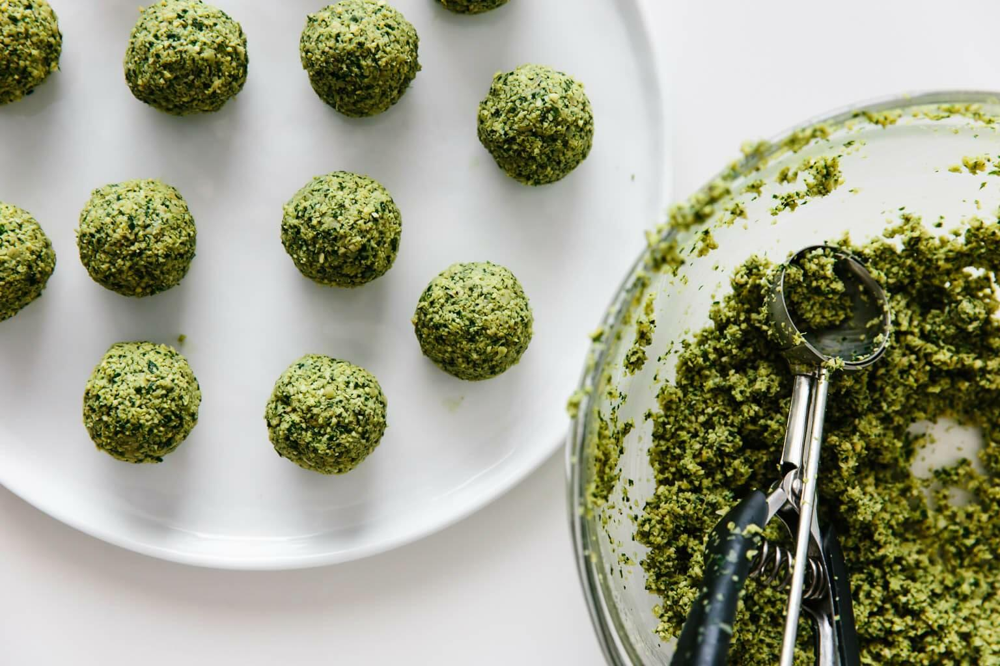

# Falafel

### INGREDIENTS
* 200g dried Chickpeas
* 1 Onion
* 4 garlic cloves
* 3 tbs chopped parsley
* 3 tbs chopped cilantro
* 2 tbsp (chickpea) flour
* 1 tsp salt
* 1 tsp cumin
* 1 tsp mild chili flakes
* 1 tsp baking soda

### INSTRUCTIONS
1. Soak the chickpeas in water for at least 12h.
2. Drain and rinse the chickpeas and add them to your food processor.
3. Add the onion, parsley, cilantro, pepper, garlic, cumin, salt, and black pepper to the food processor and pulse several times until it resembles the texture of coarse sand.
4. Transfer the falafel mixture to a bowl and add the flour and baking soda. Stir together, then cover or add a lid.
5. Refrigerate the mixture for 30 minutes to one hour.
6. Form the falafel into balls or patties. If you find the mixture is too wet, you can add another tablespoon of flour.
