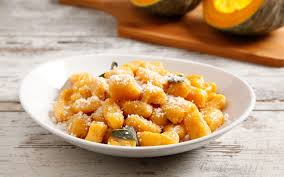

# Gnocchi di zucca

### INGREDIENTS
* 600g pumpkin
* 300g flour
* salt
#### SAUCE
* 80g butter
* sage

### INSTRUCTIONS
1. Divide the vegetables into large slices, remove the seeds, but leave the skin. Wrap them in a sheet of tin foil and place them in a hot oven at 200°C for about an hour.
2. Remove the peel from the pumpkin and mix the flesh with the flour.
3. Cut and form the dough into gnocchi
4. Boil the gnocchi in salted water and roast the sage in butter
