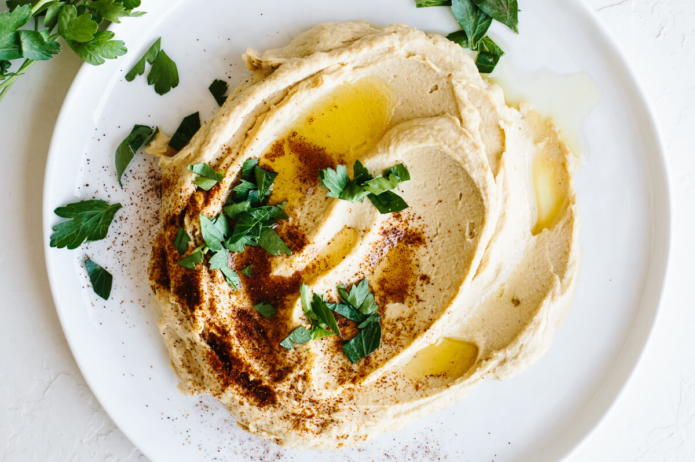

# Hummus

### INGREDIENTS
* 500ml cooked chickpeas
* 3 tbsp tahini
* 3 gloves garlic
* 2 tbsp Olive Oil
* 1 tsp pepper
* 1 tsp salt
* pinch grounded cumin
* lemon
#### Optional
* 2 roasted paprika
* 6 gloves roasted garlic
* chilli
* sun-dried tomato
* parsley
* lime

### INSTRUCTIONS
1. Add to food processor and mix until smooth. Add water as needed
