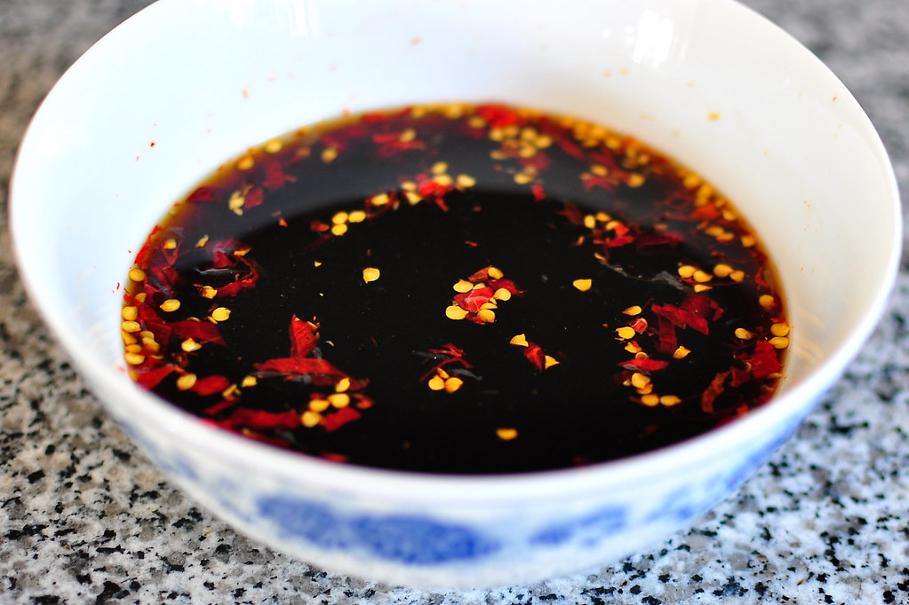

# Nuoc Cham chay – Vietnamese Vegetarian Dipping Sauce

### INGREDIENTS
* 5 garlic cloves, mashed or minced
* 1-2 whole red chilies
* 100ml cup soy sauce (Golden Mountain brand)
* 300ml hot water
* 100g sugar
* 2 limes, juiced

### INSTRUCTIONS
1. Mash together garlic, chili, and sugar with a mortar and pestle.
2. Transfer the sugar paste into a large jar and add the boiled water. Stir to dissolve sugar.
3. Add the soy sauce and lime juice and mix.
