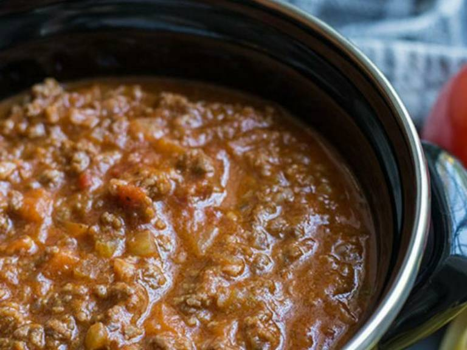

# Ragú (della nonna)

### ZUTATEN
* 1 Zwiebel
* 1 Stange Sellerie
* 1 Karotte
* 600g Rinderhack
* 300g Schweinehack
* ~200ml Rotwein
* (~400g) Packung passierte Tomaten
* 100g Tomatenmark
* Rosmarinzweig
* 4 Nelken
* Zimt

### INSTRUCTIONS
1. Zwiebel, Karotte, Staudensellerie klein Würfeln.
2. In einem Topf Gemüse und Rosmarin mit etwas Öl für ein paar minuten auf mittlerer Hitze kochen.
3. Bei hoher Hitze das Fleisch anbraten bis keine blutigen Stellen mehr zu sehen sind.
4. Mit Rotwein ablöschen (Weißwein geht auch), Herd auf mittlere Hitze und warten dass der Alkohol abgekocht ist.
5. Tomatenmark, Passierte Tomaten, Nelken und Zimt (1/2 Tl) hinzugeben.

Für beste Ergebnisse 3-5h mit Deckel köcheln lassen.
